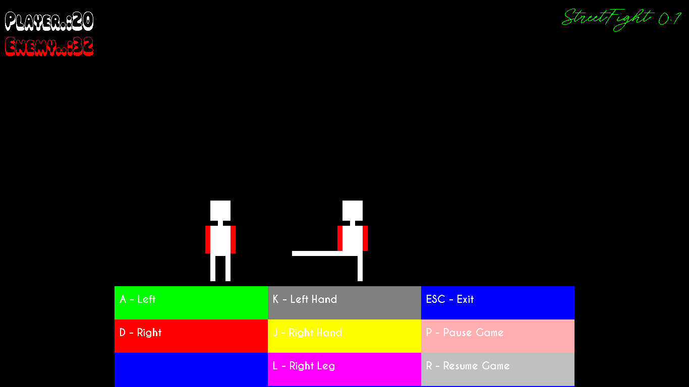
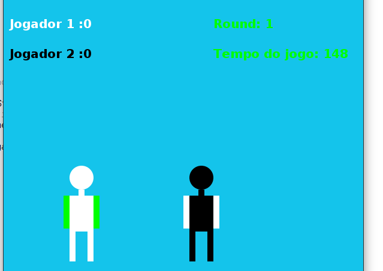
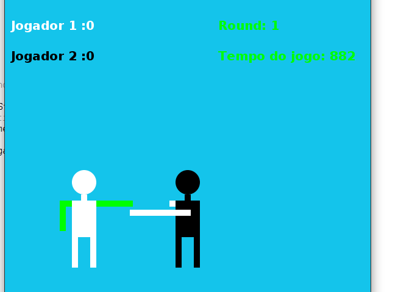
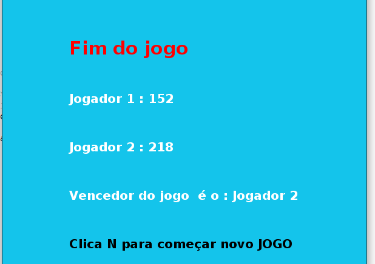

# Jogo-Street-Fight

### Português

Projecto da disciplina de Computação Grafica, totalmente feito em java 2d sem imagens, jogo de luta com dois jogadores.
o primeiro jogador depende dos movimentos do usuario (Teclado), já o segundo tem os movimentos automaticos, o jogo tem dois rounds, e quem tiver bons pontos nos dois vence o jogo e ainda tem a possibilidade de comecar novo jogo ou sair da aplicacao com ESC.
Não está totalmente concluído mas a maioria das funcionalidades já foram aplicadas.
Estou aceitando contribuições!

### English

Project of the Computer Graphics course, totally made in java 2d without images, fighting game with two players.
the first player depends on the user's movements (Keyboard), the second has automatic movements, the game has two rounds, and whoever has good points in both wins the game and still has the possibility to start a new game or exit the application with ESC. It is not fully completed but most of the features have already been applied.
I'm accepting contributions!

IDE  : Netbeans  
Languange : Java

Images of the game:

Essa imagem ilustra a primeira versao do jogo com os movimentos definidos para o jogador 1:
This image illustrates the first version of the game with the moves defined for player 1:

Nesta ultima versão procurei simplificar tudo e focar apenas em fazer eles jogarem, por isso a interface é bem simples!
In this latest version I tried to simplify everything and just focus on making them play, so the interface is very simple!

Obrigada pela visita, volte sempre! E não esquece de deixar uma estrelinha para mim!

Thanks for visiting, come back soon! And don't forget to give me a star!

## Social networks 
